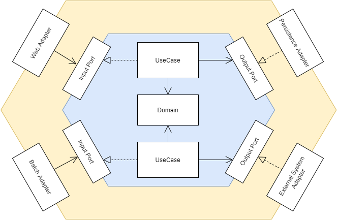
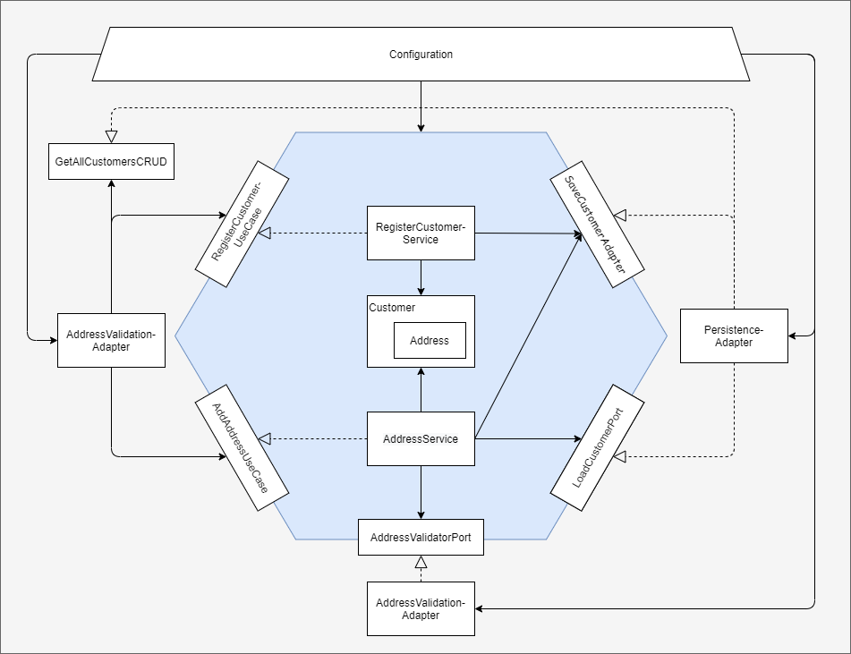

# hexagonal-example

Implementation of a hexagonal architecture in Spring Boot.

Most of the information on how to design in this way are from the following books:

[Get your hands dirty on clean architecture | Tom Hombergs](https://www.amazon.com/-/de/dp/B07YFS3DNF/ref=sr_1_1?__mk_de_DE=%C3%85M%C3%85%C5%BD%C3%95%C3%91&crid=2O6UP5K38LQV0&dchild=1&keywords=get+your+hands+dirty+on+clean+architecture&qid=1618151902&sprefix=get+your+hands+di%2Caps%2C225&sr=8-1)

[Clean Architecture: A Craftsman's Guide to Software Structure and Design | Robert C. Martin](https://www.amazon.com/-/de/dp/0134494164/ref=sr_1_1?__mk_de_DE=%C3%85M%C3%85%C5%BD%C3%95%C3%91&crid=263B083Z6653Y&dchild=1&keywords=clean+architecture&qid=1618151952&sprefix=clean+archi%2Caps%2C243&sr=8-1)

[Implementing Domain-Driven Design | Vernon Vaughn](https://www.amazon.com/-/de/dp/B00BCLEBN8/ref=sr_1_1?__mk_de_DE=%C3%85M%C3%85%C5%BD%C3%95%C3%91&crid=E6QQJD59WB0U&dchild=1&keywords=implementing+domain-driven+design&qid=1618152014&sprefix=implementing+d%2Caps%2C237&sr=8-1)

### How to run

To run this application you need to first run a

```cmd
mvn clean 
```

in the root directory of this project. This will download all required dependecies and bundle your
project properly. It will also auto generate some mapping classes with
the [mapstruct](https://mapstruct.org/) plugin.

The database for this application is a mongo db. You either need to have one running on your system,
or you can alternatively start the MongoDB in docker with the included docker-compose file.

```cmd
docker-compose -f mongodb-docker-compose up
```

Docker / docker-compose need to be installed for this.

The application can then be started by running the main function in:

```
hexagonal-example\config\src\main\java\de\strasser\peter\hexagonal\HexagonalApplication.java
```

### What does this application do

This app can register customers, add addresses to these customers and retrieve a list of all
customers.

The supported usecases in the business layer can be inspected in the applicationmodule. Under
application/src/main/java/de/strasser/peter/hexagonal/application/customer/port all the supported
operations are clearly visible, which is a major selling point to structure your application in this
way.


### Application architecture

This application tries to follow the design princples as described in Clean Architecture. To achieve
key characteristics of a good architecture (Single Responsibility, Flexibility, Testability, ... ),
one very defining lession of Robert C. Martins book is that the business logik should be at the core
of the system.


This diagram shows where dependencies in a system should point to achieve this. How to implement
this however, feels very abstract.

Alistair Cockburn took this concept and
definied [hexagonal architecture](https://en.wikipedia.org/wiki/Hexagonal_architecture_(software)).
Alternatively this style is also known as the ports and adapters architecture. Perhaps more fitting,
but certainly not as exciting sounding as a hexagon.



In the middle lives the **Domain**. This is where all the business logik is contained. Ideally this
code is free of any framework specific annotations. This is especially great for unit testing your
logik. No spring context, that has to boot, or any services that need to be mocked. Just plain
normal Java, which is easy to understand and fast to execute.

Ecapsulating these Domain models are the **Use Cases**. These represent the features that our
application provides. They receive commands and query / write the data to the adapters.

Between the Use Cases and the **Adapters** are the **Ports**. Especially the output ports are
important to control the direction of dependencies. In Java these represent interfaces. The output
adapters implement the output ports and therefore have to follow the contract, that the core of the
application defines for them. The input adapters only interact with the input ports and never with
the implementing serivces directly.

This clear separation of concerns greatly increases flexibility. If you wanted to switch from an SQL
to NoSQL DB, you'd just have to rewrite your Persistence Adapter, but the rest of the application
should not be affected by your change.

To achieve true decoupling between the application components the services are not allowed to
construct instances of objects themselves. If a use case class would construct the instance of an
output adapter in its class it would introduce dependencies into that layer, which we do not want.

For that we need an all controlling component, which instantiates all classes. This could be just a
main class in Java, where all the classes are constructed and dependencies are manually injected. In
a big enterprise application this task, would become confusing very fast. Typically, the role of
this all controlling component would be some form of DI-Framework, like Dagger, Guice, or in this
case Spring.

In the following diagram all dependencies, as they are implemented in the app are shown. The
configuration component is the component, where the Spring main function lives.



### Advantages of separated models on each layer in this example

- The customer response can easily exclude the (hashed) password without much effort. This seperates
  the concern in what way to display the data to the client.


- The AddressType properties can be annotated with web specific annotiations to control
  serialization, without cluttering the domain.


- The customer can be persisted different from the domain models structure. This way the concern on
  how to handle data persistence is independent from the business layer and can be handled by the
  persistence module.
